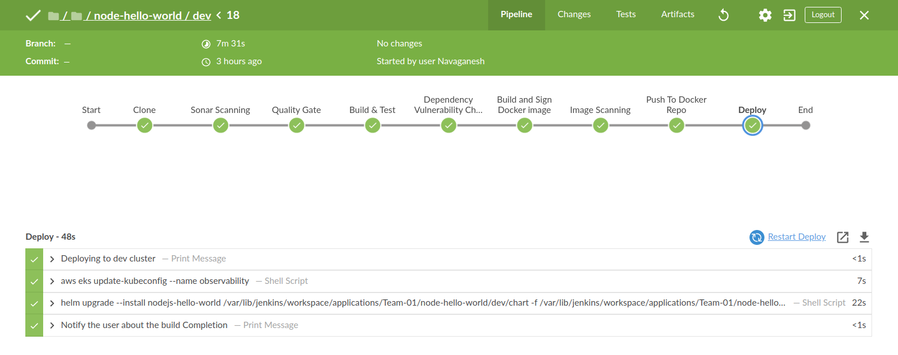
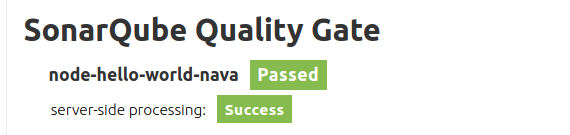
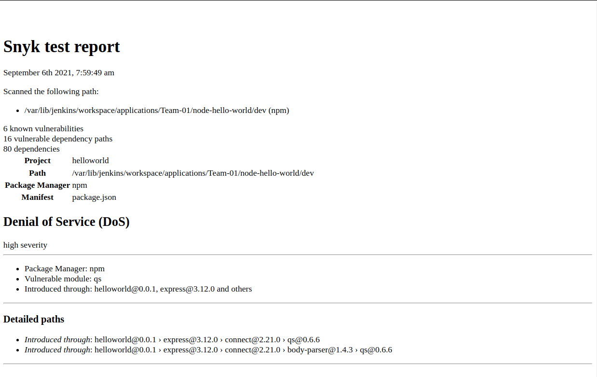
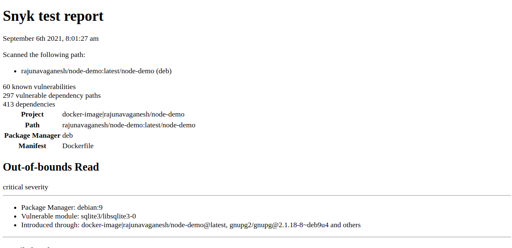
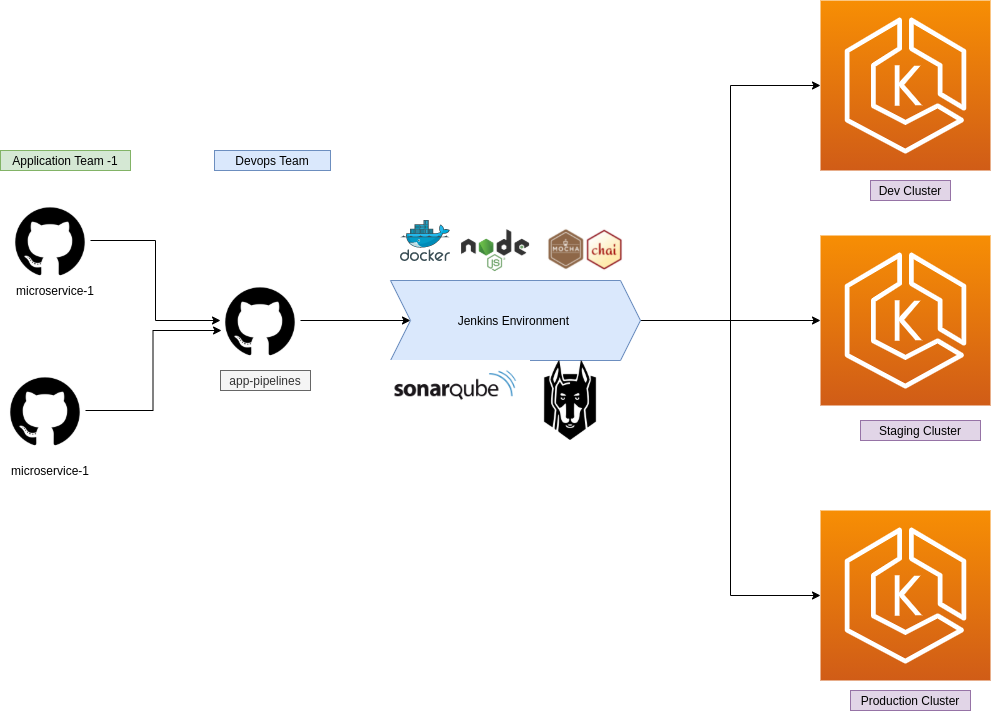
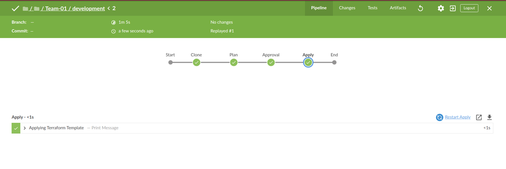

# CICD Pipeline

### Stages of CICD Pipeline
1. Clone: checks out the source code to jenkins workspace.
2. Sonar Scanning: Sonar Qube scanning is performed against the source code.
3. Quality Gate: Validateds the Quality of the source code, allows only if its passing. 
4. Build & Test: Installs the dependencies and run the unit test.
5. Dependency Vulnerability Check : snyk will perform the vulnerablity scanning on the dependencies.
6. Build and Sign Docker image: Container image is created and Signed by the notary.
7. Image Scanning: Build image is scanned by Snyk for any vulnerabilities.
8. Push To Docker Repo: Docker image is now pushed to Dockerhub.
7. Deploy: Helm Chart is deployed to dev namespace under Dev Cluster.

### High lights of my CICD pipeline

#### **Jenkins pipeline view**


#### **Sonar Scanner Result**


#### **Dependency Vulnerablity scan Report** 


#### **Container  Vulnerablity scan Report**



## CICD Process 
#### **Process Overview**


#### **CICD Process**
    Developer pushes the code to his branch and triggers the jenkins job. Jenkins builds, tests and containerizes the app and at last it will deploy it to dev namespace under the dev cluster. This is more of a happy path, which happens if all criterias are met.

**Note:** 
* The job can be tuned to fail the CICD process if the app dosent meets the required criteria
    - if code quality is not good.
    - if package used has critical vulnerabilities.
    - if unit test fails. 
    - if container has critical vulnerabilities.
* This pipeline is implementaion of DevSecOps, "shift left" approach. 
* The process will restrict the development team to follow pre defined standards, hence it makes sure that the application deployed is working, vulnerability free and has high code quality standards.

### Refernces
* Sample App for demo: https://github.com/navaganeshr/nodejs-hello-world
* pipeline implementation: https://github.com/navaganeshr/app-pipelines


# Infrastructure as code 

**Following Modules are used to create eks Cluster**
* vpc 
* eks cluster
* managed_node_group  

**Note**
* These modules are tailored to suite my requirement

## Terraform template strucure
```
├── environment #----------------------> Templatize Cluster configuration
│   ├── non-production.tfvars
│   ├── observability.tfvars
│   └── production.tfvars
├── module  #--------------------------> module definition
│   ├── eks
│   │   ├── eksCluster.tf
│   │   ├── iam.tf
│   │   ├── locals.tf
│   │   ├── securityGroup.tf
│   │   └── variable.tf
│   ├── node_group
│   │   ├── iam.tf
│   │   ├── locals.tf
│   │   ├── nodeGroup.tf
│   │   ├── output.tf
│   │   └── variable.tf
│   └── vpc
│       ├── gateways.tf
│       ├── locals.tf
│       ├── output.tf
│       ├── route_table.tf
│       ├── subnets.tf
│       ├── variable.tf
│       └── vpc.tf
├── main.tf      #------------------------> module declaration
├── provider.tf  #------------------------> Provider definition
├── backend.tf   #------------------------> Backend configuration
├── variables.tf #------------------------> Variable declaration
└── Readme.md    #------------------------> Command Reference for terraform script execution 
```

### Salient features of the terraform template
1. Template Creates following things using vpc module.
    - vpc
    - subnet
    - Route table & Route association
    - internet and Nat Gateways
2. Template Creates following things using eks module.
    - iam role required by eks
    - security group for eks
    - eks cluster 
3. Template Creates following things using node_group module.
    - iam role used by eks worker node group
    - security group used by eks worker node group
    - private managed node group     
    - public managed node group    
4. Terraform saves the state in s3 bucket. Terraform template is executed from the jenkins job. Concurrent builds are disabled, so state file locking is not needed. 

5. Template is workspaced, same template can be used to bootstrap multiple cluster using multiple workspaces.

6. Provisioning is done using jenkins pipeline.

#### **Infra Pipeline Stages**

### Refernces
* Terraform template: https://github.com/navaganeshr/eks_cluster
* pipeline implementation: https://github.com/navaganeshr/infra-pipelines

# Application Monitoring 
* Prometheus Opertor and associated tools like kube-state metrics, nodeexporter , blackbox exporter is used to monitor the eks cluster components.
* Applcations can also be monitored through prometheus if the instrumentation is implemented at the microservice level.

### About Prometheus Operator
* Prometheus Operator uses CRD (Custom Resource Definitions) to generate configuration files and identify Prometheus resources.
    * alertmanagers – defines installation for Alertmanager
    * podmonitors – determines which pods should be monitored
    * prometheuses – defines installation for Prometheus
    * prometheusrules – defines rules for alertmanager
    * servicemonitors – determines which services should be monitored
* The operator monitors Prometheus resources and generates StatefullSet (Prometheus and Alertmanager) and configuration files (prometheus.yaml, alertmanager.yaml).


### Cluster Monitoring 


### Application Monitoring 

# service monitors: 
* 
